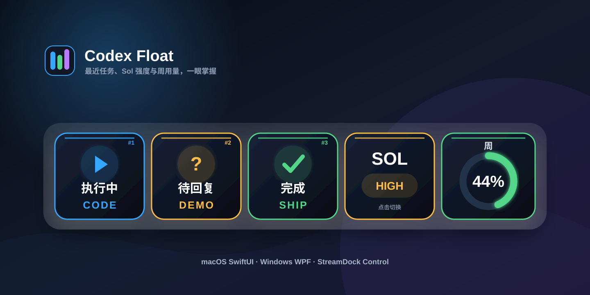
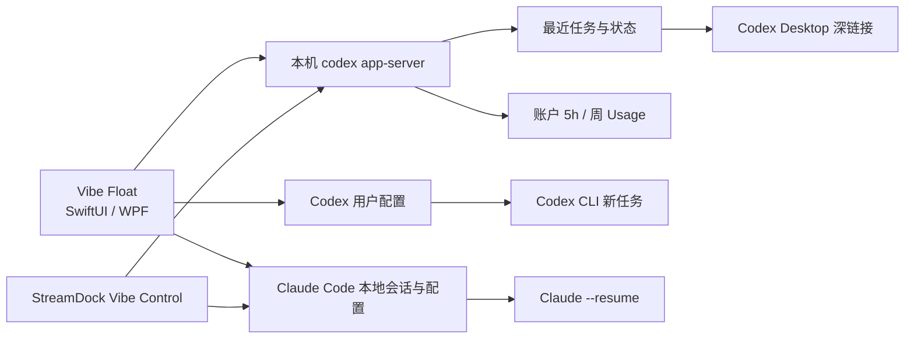

<div align="center">

[简体中文](README.md) · [English](README_EN.md) · [日本語](README_JA.md)




# Vibe Float & StreamDock Control

**把 Codex 与 Claude Code 的任务、模型、Effort 和 Usage 组合成自己的桌面悬浮控制台。**

[](https://github.com/saheru/vibe-float/releases)
[](https://github.com/saheru/vibe-float/releases)
[](https://github.com/saheru/vibe-float/releases)
[](macos/CodexFloat)
[](LICENSE)

[下载最新版](https://github.com/saheru/vibe-float/releases/latest) ·
[更新日志](CHANGELOG.md) ·
[StreamDock 插件](#-streamdock-control) ·
[使用方法](#-使用方法) ·
[开发构建](#-开发与构建) ·
[提交问题](https://github.com/saheru/vibe-float/issues)

</div>

---

本项目提供 **macOS SwiftUI**、**Windows WPF** 悬浮工具和通用 **StreamDock Vibe Control** 插件。Vibe Float 从本机 `codex app-server` 与 Claude Code 会话文件读取状态，不需要浏览器扩展或第三方服务端。


## ✨ 可配置模块

| 模块 | 显示 | 操作 |
|---|---|---|
| 最近任务 1～8 | 数量可设，混合排列最近的 Codex 与 Claude 任务，显示来源、状态和项目缩写 | Codex 跳转桌面任务；Claude 在终端恢复会话 |
| Codex · Sol Effort | `minimal`～`ultra`，不同 effort 使用不同颜色 | 点击循环切换 |
| Codex · 5h Usage | 5 小时限额、阈值颜色和动态进度轮 | 自动刷新 |
| Codex · 周 Usage | 实时百分比、阈值颜色和动态进度轮 | 自动刷新 |
| Claude · Model | 当前 Claude Code 模型 | 点击循环切换 |
| Claude · Effort | `low`～`max` | 点击循环切换 |
| Claude · 周 Usage | Claude 7d 限额进度轮 | 通过本地 Status Line 采集刷新 |

最近任务数量可以在菜单中设置为 1～8 个，其余模块均可单独开关。Codex · 5h Usage 固定排在 Codex · 周 Usage 之前。Vibe Float 会根据启用数量自动切换单行或多行网格，并同步调整窗口尺寸。

## 🖥 使用方法

- 面板始终置顶，并可显示在所有桌面空间。
- 从 macOS 菜单栏或 Windows 面板右键菜单设置“最近任务数量”，并在“显示模块”中自由组合其余模块。
- 拖动空白区域移动窗口。
- 拖动右下角的白色缩放手柄等比调整大小。
- 右键面板可立即刷新或退出。
- 自动区分 Codex CLI 与桌面任务：CLI 任务在终端通过 `codex resume <id>` 恢复，桌面任务通过 `codex://threads/<id>` 打开 Codex Desktop。
- 支持自动识别 Otty 中正在运行的 Codex / Claude 会话并精确切回原标签页；也可选择 Terminal、iTerm2、Ghostty、Kitty 或 WezTerm 作为 CLI 任务终端。
- Claude 任务通过 `claude --resume <session-id>` 在终端恢复。
- 点击 Sol 卡片会更新 Codex 用户配置，新建 Codex CLI 任务也会使用新的模型和 effort。
- Claude Model 与 Effort 卡片会更新 `~/.claude/settings.json`，供新建 Claude Code 会话使用。

### Claude Usage

Claude Code 的限额数据由 Status Line 提供。首次使用时选择：

- macOS 菜单栏：**Vibe Float → Claude → 启用 Usage 采集**
- Windows 面板右键：**启用 Claude Usage 采集**

Vibe Float 会保留并继续调用用户原有的 Status Line 命令。启用后重启 Claude Code 会话即可看到 `CL · 周` 进度轮。

## 📦 安装

从 [Releases](https://github.com/saheru/vibe-float/releases/latest) 下载。

### macOS

- `Vibe-Float-macOS.dmg`：推荐，打开后拖入 Applications。
- `Vibe-Float-macOS.zip`：解压后拖入 Applications。

首次运行请右键 **Vibe Float → 打开**。如果 macOS 仍拦截本地签名版本：

```bash
xattr -dr com.apple.quarantine "/Applications/Vibe Float.app"
```

### 运行要求

- macOS 14 或更高版本。
- 支持 Apple Silicon 与 Intel Mac。
- 已安装并登录 Codex CLI。
- 若启用 Claude 模块，需要安装 Claude Code。
- CLI 任务点击后需要本机可用的 Codex CLI；桌面任务点击跳转需要 Codex Desktop。

### Windows

下载 `Vibe-Float-Windows-x64.zip`，**完整解压整个目录**后运行 `Start-Vibe-Float.cmd`（推荐）或 `VibeFloat.exe`。不要直接在压缩包预览窗口中启动。若启动失败，诊断日志位于 `%LOCALAPPDATA%\Vibe Float\startup.log`。

- Windows 10 或 Windows 11 x64。
- 发布包为 self-contained，不需要单独安装 .NET。
- 已安装并登录 Codex CLI。
- CLI 任务会打开终端并恢复；桌面任务需要已注册 `codex://` 协议的 Codex Desktop。

## 🧠 工作原理



Vibe Float 默认按以下顺序查找 Codex：

1. `$CODEX_PATH`
2. `~/.local/share/fnm/aliases/default/bin/codex`
3. `~/.local/bin/codex`
4. `/opt/homebrew/bin/codex`
5. `/usr/local/bin/codex`

Sol 模型与推理强度通过 `config/batchWrite` 写入 Codex 用户配置。

> 已运行任务不会在中途更换模型或 effort；新建任务会采用更新后的配置。命令行显式参数优先于用户配置。

## 🎛 StreamDock Control

插件适用于支持 Keypad、Knob 和 Information 控制器的 StreamDock 设备，不依赖具体设备型号。

| Action | 控制方式 | 功能 |
|---|---|---|
| Codex 任务 | 可视按键 | 显示最近任务状态与项目缩写；点击切换任务 |
| 模型与推理层级 | 旋钮 / 按键 | 切换模型和当前模型支持的 reasoning effort |
| Codex 权限 | 旋钮 / 按键 | 切换只读、工作区与完全访问 |
| 当前模型 | 可视按键 | 显示并切换当前模型 |
| 当前权限 | 可视按键 | 显示并切换当前权限 |
| Sol 推理强度 | 旋钮 / 可视按键 | 切换 Sol effort，并使用分级颜色 |
| 5h Usage | 可视按键 / 信息屏 | 5 小时限额进度轮 |
| 周 Usage | 可视按键 / 信息屏 | 周限额、重置时间与进度轮 |
| Claude 任务 | 可视按键 | 显示最近 Claude CLI 任务状态；点击在终端恢复 |
| Claude Model | 旋钮 / 可视按键 | 显示并切换新建 Claude CLI 会话的默认模型 |
| Claude Effort | 旋钮 / 可视按键 | 显示并切换 `low`～`max` |
| Claude 5h Usage | 可视按键 / 信息屏 | Claude 5 小时限额进度轮 |
| Claude 周 Usage | 可视按键 / 信息屏 | Claude 7 天限额进度轮 |

Codex 与 Claude 任务完成或等待回复时都可以播放增强提示音，并显示带任务标题、来源和状态的系统通知。Claude 的 Model 与 Effort 写入 `~/.claude/settings.json`，对新建 Claude Code CLI 会话生效。

插件会检测 Codex 登录身份变化；切换 Codex 账号后会自动重启本地 `app-server`，清除旧账号缓存，并刷新模型与 5h/周 Usage，无需重新添加按键。

首次使用 Claude Usage 时，在对应动作的属性面板点击 **启用 Claude Usage 采集**，然后重启正在运行的 Claude CLI 会话。插件会保留并继续调用原有 Status Line 命令。

### 打包

```bash
npm install
npm test
npm run package:streamdock
```

生成 `dist/com.tlm.codex-control.sdPlugin.zip`。

### 手动安装

将 `com.tlm.codex-control.sdPlugin` 复制到 StreamDock 的插件目录，然后重启 StreamDock 软件：

- macOS：`~/Library/Application Support/HotSpot/StreamDock/plugins/`
- Windows：`%APPDATA%\HotSpot\StreamDock\plugins\`

macOS 也可以直接运行：

```bash
./scripts/install-codex-streamdock-macos.sh
```

## 🛠 开发与构建

### 环境

- Swift 6
- Node.js 20+
- macOS Command Line Tools
- 已安装 Codex CLI

### 构建通用 macOS 应用

```bash
git clone https://github.com/saheru/vibe-float.git
cd vibe-float
./scripts/build-vibe-float.sh
```

构建脚本同时生成 Apple Silicon 与 Intel 架构：

```text
dist/
├── Vibe Float.app
├── Vibe-Float-macOS.dmg
└── Vibe-Float-macOS.zip
```

安装本地构建：

```bash
./scripts/install-vibe-float.sh
```

### 构建 Windows 应用

在 Windows 与 .NET 8 SDK 环境运行：

```powershell
dotnet publish .\windows\CodexFloat\CodexFloat.csproj `
  -c Release -r win-x64 --self-contained true `
  -p:PublishSingleFile=false
```

仓库中的 GitHub Actions 会自动构建免安装 Windows x64 压缩包。

## 📁 项目结构

```text
.
├── macos/CodexFloat/
│   ├── Package.swift
│   └── Sources/CodexFloat/
├── windows/CodexFloat/               # Windows 10/11 WPF 版本
├── com.tlm.codex-control.sdPlugin/   # 通用 StreamDock Codex + Claude 插件
├── test/plugin.test.js               # StreamDock 插件测试
├── docs/images/
├── .github/workflows/                 # Windows 自动构建
└── scripts/
    ├── build-vibe-float.sh
    └── install-vibe-float.sh
```

## 🔒 隐私

- 所有任务和 Usage 数据都在本机读取与渲染。
- 不包含遥测、统计 SDK 或第三方服务端。
- 不读取或上传 Codex 登录凭据。
- 不读取或上传 Claude 登录凭据；Claude Usage 由本机 Status Line 数据提供。

## 🤝 贡献

欢迎提交 Issue 和 Pull Request。开始前请阅读 [CONTRIBUTING.md](CONTRIBUTING.md)。

## 📄 License

[MIT](LICENSE) © 2026 tlm
