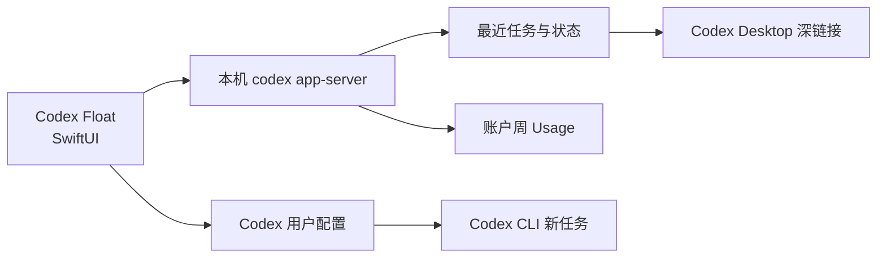

<div align="center">


# Codex Float

**把 Codex 最近任务、Sol 推理强度和周 Usage 放进原生桌面悬浮面板。**

[](https://github.com/saheru/codex-float/releases)
[](https://github.com/saheru/codex-float/releases)
[](https://github.com/saheru/codex-float/releases)
[](macos/CodexFloat)
[](LICENSE)

[下载最新版](https://github.com/saheru/codex-float/releases/latest) ·
[使用方法](#-使用方法) ·
[开发构建](#-开发与构建) ·
[提交问题](https://github.com/saheru/codex-float/issues)

</div>

---

Codex Float 是一个轻量的原生桌面悬浮工具，提供 **macOS SwiftUI** 和 **Windows WPF** 两个版本，通过本机 `codex app-server` 读取 Codex 状态。无需浏览器扩展，无需云端服务，不保存 Token。


## ✨ 五区面板

| 区域 | 显示 | 操作 |
|---|---|---|
| 最近任务 × 3 | 执行中、待回复、完成、错误与项目缩写 | 点击跳转到对应 Codex 任务 |
| Sol 推理强度 | `minimal`～`ultra`，不同 effort 使用不同颜色 | 点击循环切换 |
| 周 Usage | 实时百分比、阈值颜色和动态进度轮 | 每 3 秒自动刷新 |

任务状态使用 app-server 事件触发刷新，并以 0.8 秒独立轮询兜底；不会再被 Usage 或模型请求阻塞。

## 🖥 使用方法

- 面板始终置顶，并可显示在所有桌面空间。
- 拖动空白区域移动窗口。
- 拖动右下角的白色缩放手柄等比调整大小。
- 右键面板可立即刷新或退出。
- 点击任务通过 `codex://threads/<id>` 打开 Codex Desktop。
- 点击 Sol 卡片会更新 Codex 用户配置，新建 Codex CLI 任务也会使用新的模型和 effort。

## 📦 安装

从 [Releases](https://github.com/saheru/codex-float/releases/latest) 下载。

### macOS

- `Codex-Float-macOS.dmg`：推荐，打开后拖入 Applications。
- `Codex-Float-macOS.zip`：解压后拖入 Applications。

首次运行请右键 **Codex Float → 打开**。如果 macOS 仍拦截本地签名版本：

```bash
xattr -dr com.apple.quarantine "/Applications/Codex Float.app"
```

### 运行要求

- macOS 14 或更高版本。
- 支持 Apple Silicon 与 Intel Mac。
- 已安装并登录 Codex CLI。
- 点击任务跳转需要 Codex Desktop。

### Windows

下载 `Codex-Float-Windows-x64.zip`，解压后运行 `CodexFloat.exe`。

- Windows 10 或 Windows 11 x64。
- 发布包为 self-contained，不需要单独安装 .NET。
- 已安装并登录 Codex CLI。
- 点击任务跳转需要已注册 `codex://` 协议的 Codex Desktop。

## 🧠 工作原理



Codex Float 默认按以下顺序查找 Codex：

1. `$CODEX_PATH`
2. `~/.local/share/fnm/aliases/default/bin/codex`
3. `~/.local/bin/codex`
4. `/opt/homebrew/bin/codex`
5. `/usr/local/bin/codex`

Sol 模型与推理强度通过 `config/batchWrite` 写入 Codex 用户配置。

> 已运行任务不会在中途更换模型或 effort；新建任务会采用更新后的配置。命令行显式参数优先于用户配置。

## 🛠 开发与构建

### 环境

- Swift 6
- macOS Command Line Tools
- 已安装 Codex CLI

### 构建通用 macOS 应用

```bash
git clone https://github.com/saheru/codex-float.git
cd codex-float
./scripts/build-codex-float.sh
```

构建脚本同时生成 Apple Silicon 与 Intel 架构：

```text
dist/
├── Codex Float.app
├── Codex-Float-macOS.dmg
└── Codex-Float-macOS.zip
```

安装本地构建：

```bash
./scripts/install-codex-float.sh
```

### 构建 Windows 应用

在 Windows 与 .NET 8 SDK 环境运行：

```powershell
dotnet publish .\windows\CodexFloat\CodexFloat.csproj `
  -c Release -r win-x64 --self-contained true `
  -p:PublishSingleFile=true
```

仓库中的 GitHub Actions 会自动构建免安装 Windows x64 压缩包。

## 📁 项目结构

```text
.
├── macos/CodexFloat/
│   ├── Package.swift
│   └── Sources/CodexFloat/
├── windows/CodexFloat/               # Windows 10/11 WPF 版本
├── docs/images/
├── .github/workflows/                 # Windows 自动构建
└── scripts/
    ├── build-codex-float.sh
    └── install-codex-float.sh
```

## 🔒 隐私

- 所有任务和 Usage 数据都在本机读取与渲染。
- 不包含遥测、统计 SDK 或第三方服务端。
- 不读取或上传 Codex 登录凭据。
- 只启动本机 `codex app-server` 并使用结构化接口。

## 🤝 贡献

欢迎提交 Issue 和 Pull Request。开始前请阅读 [CONTRIBUTING.md](CONTRIBUTING.md)。

## 📄 License

[MIT](LICENSE) © 2026 tlm
