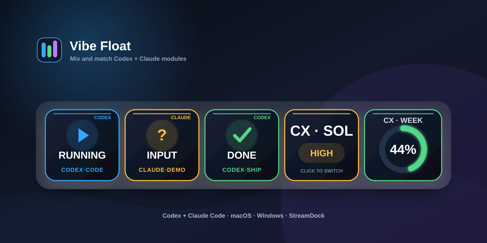
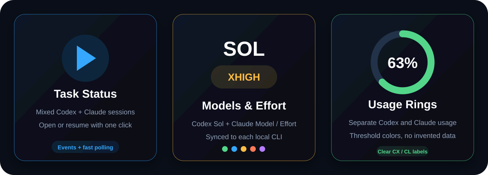
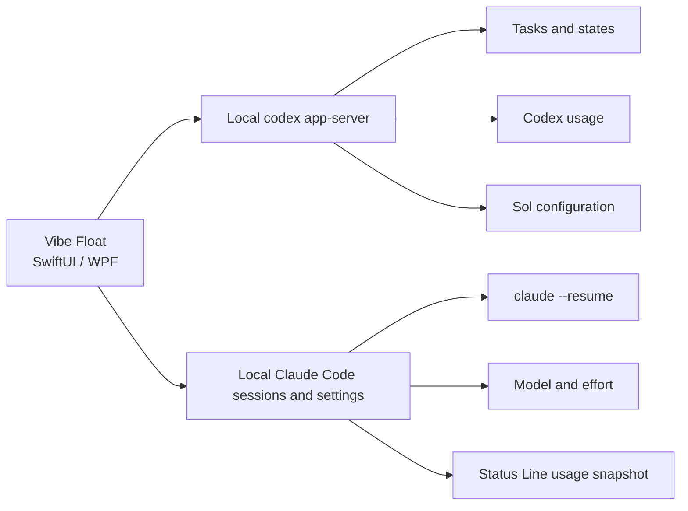

<div align="center">

[简体中文](README.md) · **English** · [日本語](README_JA.md)




# Vibe Float & StreamDock Control

**A configurable floating dashboard for Codex and Claude Code tasks, models, effort levels, and usage.**

[](https://github.com/saheru/vibe-float/releases)
[](https://github.com/saheru/vibe-float/releases)
[](https://github.com/saheru/vibe-float/releases)
[](LICENSE)

[Download the latest release](https://github.com/saheru/vibe-float/releases/latest) ·
[Modules](#configurable-modules) ·
[Installation](#installation) ·
[StreamDock](#streamdock-codex-control)

</div>

---

Vibe Float is a native **SwiftUI app for macOS** and **WPF app for Windows**. It combines recent Codex and Claude Code sessions in one always-on-top panel, while keeping every module optional.

All task and usage data stays on your computer. Codex data comes from the local `codex app-server`; Claude sessions and settings are read from Claude Code's local files.



## Configurable modules

| Module | What it shows | Action |
|---|---|---|
| Recent Tasks 1–8 | A configurable number of the most recently updated Codex or Claude sessions | Open Codex Desktop or resume Claude in Terminal |
| Codex · Sol Effort | The current Sol reasoning effort with level-specific colors | Click to cycle the effort |
| Codex · 5h Usage | Live five-hour usage with a threshold-colored progress ring | Refreshes automatically |
| Codex · Weekly Usage | Live weekly usage with a threshold-colored progress ring | Refreshes automatically |
| Claude · Model | The default Claude Code model | Click to cycle the model |
| Claude · Effort | `low`, `medium`, `high`, `xhigh`, or `max` | Click to cycle the effort |
| Claude · Weekly Usage | Claude's seven-day limit in a separate progress ring | Collected locally through Status Line |

Choose from 1–8 recent task cards and enable any combination of the remaining modules. Codex 5h Usage is placed immediately before Codex Weekly Usage. Vibe Float automatically switches between a single row and a compact grid, then adjusts the window size to match.

## Automatic task detection

- Codex and Claude sessions are merged by their real last-updated time.
- A blue **CODEX** badge and `CODEX·PROJECT` label identify Codex tasks.
- An orange **CLAUDE** badge and `CLAUDE·PROJECT` label identify Claude tasks.
- State colors remain independent: running, waiting for input, completed, or failed.
- Codex tasks open through `codex://threads/<id>`.
- Claude tasks open a terminal and run `claude --resume <session-id>`.

If the Codex child process exits, Vibe Float automatically reconnects every two seconds. Claude tasks remain available while Codex reconnects.

## Installation

Download the latest files from [GitHub Releases](https://github.com/saheru/vibe-float/releases/latest).

### macOS

- Download `Vibe-Float-macOS.dmg` and drag **Vibe Float** into Applications.
- Alternatively, use `Vibe-Float-macOS.zip`.
- Supports macOS 14+, Apple Silicon, and Intel Macs.
- Install and sign in to Codex CLI and/or Claude Code for the corresponding modules.

If Gatekeeper blocks the locally signed build:

```bash
xattr -dr com.apple.quarantine "/Applications/Vibe Float.app"
```

Vibe Float runs as a menu-bar utility without a Dock icon. Use the menu-bar icon to configure modules, refresh data, or quit.

### Windows

- Download `Vibe-Float-Windows-x64.zip`.
- Extract it and run `VibeFloat.exe`.
- Supports Windows 10/11 x64.
- The package is self-contained; a separate .NET installation is not required.

## Claude Usage setup

Claude rate-limit information is supplied to Status Line by Claude Code. Enable the local capture bridge once:

- **macOS:** Vibe Float menu → **Claude** → `启用 Usage 采集` (Enable Usage Capture)
- **Windows:** right-click the panel → **Enable Claude Usage Capture**

Restart active Claude Code sessions afterward. The bridge preserves and continues to execute your existing Status Line command. Credentials are never read or stored.

## Controls

- Drag an empty area to move the window.
- Drag the lower-right handle to resize.
- Click a task to open or resume it.
- Click a model or effort card to cycle its value.
- Right-click the panel to refresh or quit.
- Configure visible modules from the macOS menu bar or Windows context menu.
- Set the number of recent task cards from the same menu.

## How it works



## StreamDock Codex Control

The repository also contains a generic StreamDock plugin for Codex:

- Recent task buttons
- Model and reasoning-effort controls
- Permission controls
- Dedicated Sol effort control
- Five-hour and weekly usage rings
- Completion and waiting-for-input notifications

The StreamDock plugin remains Codex-specific; Vibe Float desktop apps support both Codex and Claude Code.

## Build from source

### macOS

```bash
git clone https://github.com/saheru/vibe-float.git
cd vibe-float
./scripts/build-vibe-float.sh
```

### Windows

```powershell
dotnet publish .\windows\CodexFloat\CodexFloat.csproj `
  -c Release -r win-x64 --self-contained true `
  -p:PublishSingleFile=true
```

## Privacy

- No analytics, telemetry SDK, or third-party backend.
- Tasks, settings, and usage snapshots remain local.
- Codex and Claude credentials are never read or uploaded.
- Claude Usage capture only stores the Status Line JSON snapshot locally.

## License

[MIT](LICENSE) © 2026 tlm
