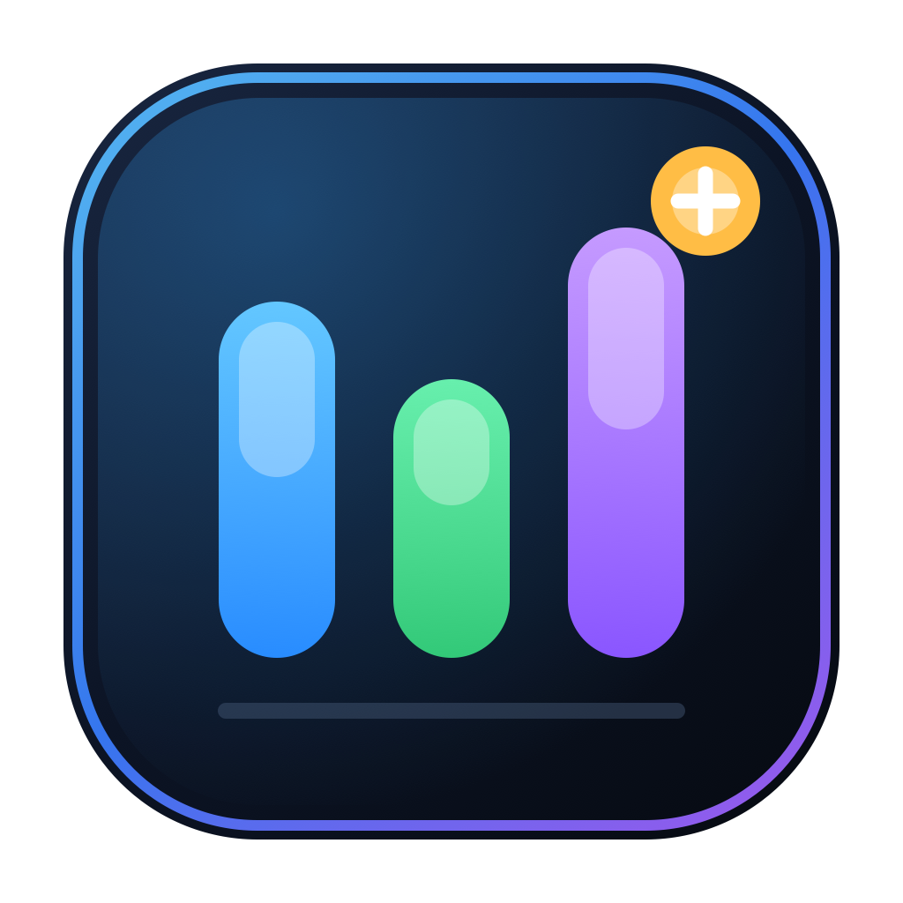
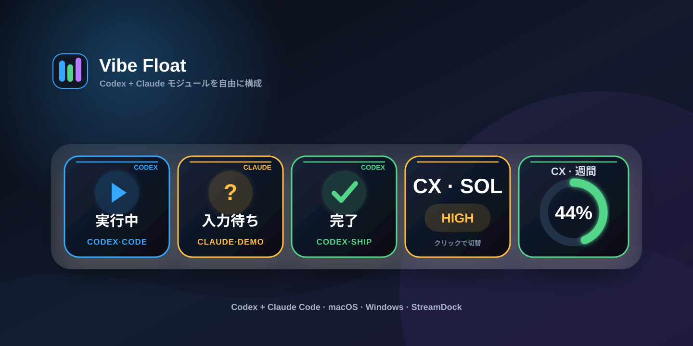
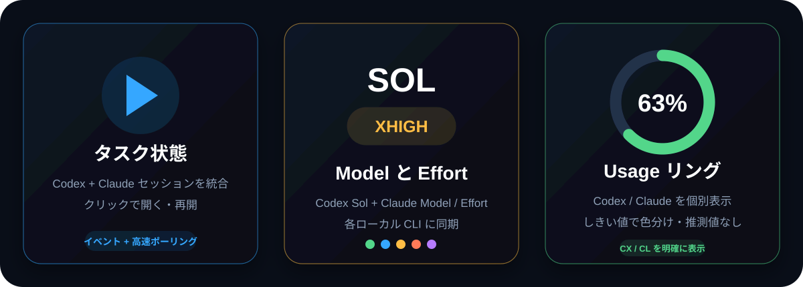
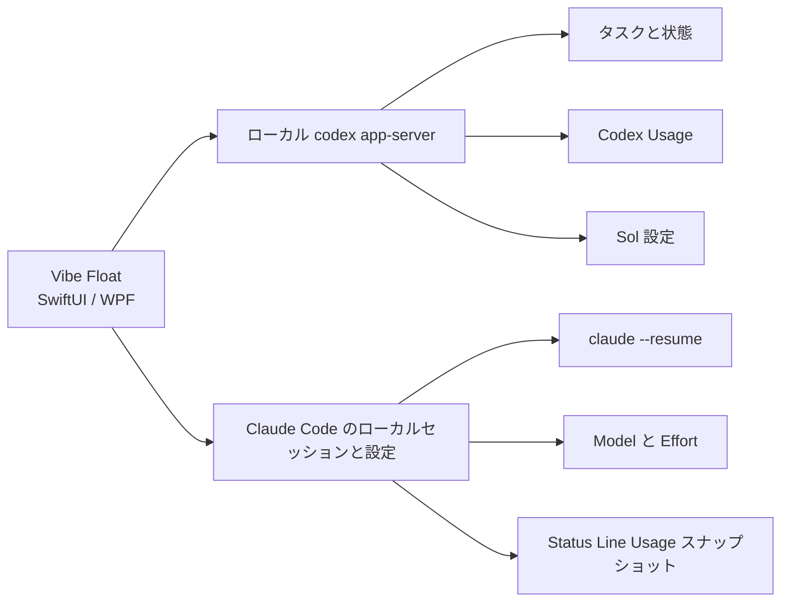

<div align="center">

[简体中文](README.md) · [English](README_EN.md) · **日本語**





# Vibe Float & StreamDock Control

**Codex と Claude Code のタスク、モデル、Effort、Usage を自由に組み合わせられるフローティングダッシュボード。**

[](https://github.com/saheru/vibe-float/releases)
[](https://github.com/saheru/vibe-float/releases)
[](https://github.com/saheru/vibe-float/releases)
[](LICENSE)

[最新版をダウンロード](https://github.com/saheru/vibe-float/releases/latest) ·
[モジュール](#設定可能なモジュール) ·
[インストール](#インストール) ·
[StreamDock](#streamdock-vibe-control)

</div>

---

Vibe Float は、**macOS 向け SwiftUI アプリ**と**Windows 向け WPF アプリ**です。Codex と Claude Code の最近のセッションを、常に手前に表示できる一つのパネルへまとめます。

タスクと Usage のデータはすべてローカルで処理されます。Codex はローカルの `codex app-server`、Claude は Claude Code のローカルセッションと設定ファイルから読み取ります。



## 設定可能なモジュール

| モジュール | 表示内容 | 操作 |
|---|---|---|
| 最近のタスク 1～8 | 表示数を設定できる、更新日時が新しい Codex / Claude セッション | Codex Desktop を開く、または Claude をターミナルで再開 |
| Codex · Sol Effort | 現在の Sol 推論強度をレベル別の色で表示 | クリックして切り替え |
| Codex · 5h Usage | 5 時間制限をしきい値で色が変わる進捗リングで表示 | 自動更新 |
| Codex · 週間 Usage | しきい値で色が変わる進捗リング | 自動更新 |
| Claude · Model | Claude Code の既定モデル | クリックして切り替え |
| Claude · Effort | `low`、`medium`、`high`、`xhigh`、`max` | クリックして切り替え |
| Claude · 週間 Usage | Claude の 7 日間制限を専用リングで表示 | Status Line からローカル取得 |

最近のタスクは 1～8 件から表示数を選択でき、その他のモジュールは個別に表示・非表示にできます。Codex 5h Usage は Codex 週間 Usage の直前に配置されます。選択数に応じて、一列表示またはコンパクトなグリッドへ自動配置し、ウィンドウサイズも調整します。

## タスクの自動判別

- Codex と Claude のセッションを実際の最終更新日時で統合します。
- Codex は青い **CODEX** バッジと `CODEX·PROJECT` で表示します。
- Claude はオレンジ色の **CLAUDE** バッジと `CLAUDE·PROJECT` で表示します。
- 実行中、入力待ち、完了、エラーの状態色はタスク種別と独立しています。
- Codex タスクは `codex://threads/<id>` で開きます。
- Claude タスクはターミナルで `claude --resume <session-id>` を実行します。

Codex の子プロセスが終了した場合は 2 秒ごとに自動再接続します。再接続中も Claude タスクは引き続き表示されます。

## インストール

[GitHub Releases](https://github.com/saheru/vibe-float/releases/latest) から最新版をダウンロードしてください。

### macOS

- `Vibe-Float-macOS.dmg` を開き、**Vibe Float** を Applications へドラッグします。
- `Vibe-Float-macOS.zip` も利用できます。
- macOS 14 以降、Apple Silicon と Intel Mac に対応します。
- 使用するモジュールに応じて、Codex CLI または Claude Code をインストールしてログインしてください。

Gatekeeper にブロックされた場合：

```bash
xattr -dr com.apple.quarantine "/Applications/Vibe Float.app"
```

Vibe Float は Dock アイコンを表示しないメニューバーユーティリティとして動作します。メニューバーからモジュール設定、更新、終了を実行できます。

### Windows

- `Vibe-Float-Windows-x64.zip` をダウンロードします。
- 展開して `VibeFloat.exe` を実行します。
- Windows 10/11 x64 に対応します。
- 自己完結型のため、.NET を別途インストールする必要はありません。

## Claude Usage の設定

Claude Code はレート制限情報を Status Line に渡します。最初に一度だけローカル取得を有効化してください。

- **macOS:** Vibe Float メニュー → **Claude** → `启用 Usage 采集`（Usage 取得を有効化）
- **Windows:** パネルを右クリック → `启用 Claude Usage 采集`（Claude Usage 取得を有効化）

その後、実行中の Claude Code セッションを再起動します。既存の Status Line コマンドは保持され、引き続き実行されます。認証情報は読み取りません。

## 操作

- 空白部分をドラッグして移動します。
- 右下のハンドルをドラッグしてサイズを変更します。
- タスクをクリックして開く、または再開します。
- Model / Effort カードをクリックして値を切り替えます。
- パネルを右クリックして更新または終了します。
- macOS のメニューバー、または Windows のコンテキストメニューから表示モジュールを設定します。
- 同じメニューから最近のタスク表示数を 1～8 件に設定できます。

## 仕組み



## StreamDock Vibe Control

リポジトリには Codex と Claude Code 用の汎用 StreamDock プラグインも含まれています。

- 最近のタスクボタン
- Model / Reasoning Effort の操作
- 権限モードの操作
- Sol Effort 専用操作
- 5 時間・週間 Usage リング
- 完了・入力待ちの通知
- Claude CLI タスク表示とターミナルでの再開
- Claude Model / Effort の個別操作
- Claude の 5 時間・週間 Usage リング

Claude Model / Effort は `~/.claude/settings.json` に保存され、新しい Claude Code CLI セッションへ反映されます。Claude Usage アクションのプロパティ画面でローカル Status Line 取得を有効にし、実行中の Claude CLI セッションを再起動してください。

## ソースからビルド

### macOS

```bash
git clone https://github.com/saheru/vibe-float.git
cd vibe-float
./scripts/build-vibe-float.sh
```

### Windows

```powershell
dotnet publish .\windows\CodexFloat\CodexFloat.csproj `
  -c Release -r win-x64 --self-contained true `
  -p:PublishSingleFile=true
```

## プライバシー

- 解析 SDK、テレメトリ、外部バックエンドはありません。
- タスク、設定、Usage スナップショットはローカルに保存されます。
- Codex / Claude の認証情報を読み取ったりアップロードしたりしません。
- Claude Usage 取得は Status Line の JSON スナップショットだけをローカル保存します。

## ライセンス

[MIT](LICENSE) © 2026 tlm
